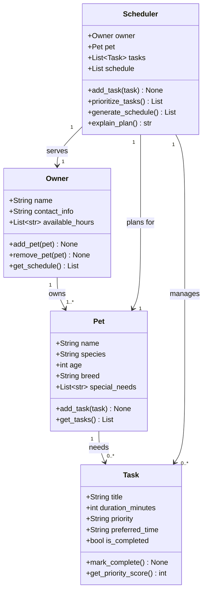

# PawPal+ Project Reflection

## 1. System Design

**a. Initial design**

The initial UML design uses four classes connected around a central `Scheduler`:

**Class responsibilities:**

I chose four classes, each with a focused, single responsibility:

- **`Task`** — Represents one atomic unit of pet care (e.g., "morning walk", "feed breakfast", "give medication"). It stores how long the activity takes (`duration_minutes`), how urgent it is (`priority`: low/medium/high), and an optional preferred start time. It exposes `mark_complete()` to track completion and `get_priority_score()` to return a numeric value used for sorting, so the rest of the system never has to know the string-to-number mapping directly.

- **`Pet`** — Models the animal being cared for. It holds identity data (name, species, age, breed) plus a `special_needs` list that captures medical or behavioral requirements (e.g., "insulin injection", "no grain food"). It also owns a private `_tasks` list and exposes `add_task()` / `get_tasks()` so tasks are always accessed through the pet they belong to, keeping data encapsulated.

- **`Owner`** — Represents the person managing care. Its most important field is `available_hours` — the list of time slots the owner is actually free — which the `Scheduler` uses as the only valid slots for placing tasks. It also maintains the list of pets via `add_pet()` / `remove_pet()` / `get_pets()`, making it easy to extend the system to multiple pets later.

- **`Scheduler`** — The coordination class. It takes a specific `Owner` and `Pet` at construction and serves as the single place where scheduling logic lives. `prioritize_tasks()` sorts the task pool by priority score and preferred time; `generate_schedule()` maps sorted tasks onto the owner's available hour slots and produces a list of `{time, task, reason}` dicts; and `explain_plan()` turns that list into a human-readable summary. By keeping all scheduling decisions here, the other three classes stay simple data holders.

**b. Design changes**

Yes, three changes were made after reviewing the skeleton against the intended design:

**1. `Scheduler.add_task()` now syncs `Pet._tasks`**

In the original skeleton, `Pet._tasks` and `Scheduler.tasks` were two independent lists with no connection. You could add a task to the scheduler and the pet would never know about it, or vice versa. I fixed `Scheduler.add_task()` so it appends to both lists (via `pet.add_task()`), making `Pet._tasks` the single source of truth and eliminating the risk of the two lists drifting out of sync.

**2. `prioritize_tasks()` uses `"23:59"` as a fallback for `None` preferred times**

The original sort key was `(priority_score, preferred_time)`. Because `preferred_time` is `Optional[str]`, any task without a preferred time would produce a `None` in the tuple, causing a `TypeError` in Python 3 when two such tasks were compared against each other. I changed the key to `t.preferred_time or "23:59"` so tasks without a preference sort to the end of the day rather than crashing.

**3. `generate_schedule()` flags overflow tasks as `UNSCHEDULED` instead of silently dropping them**

The original design had no mechanism for the case where total task time exceeds available slots. Rather than dropping extra tasks silently (a debugging nightmare), I added an explicit overflow path: tasks that cannot be placed are added to the schedule with `time = "UNSCHEDULED"` and a descriptive reason string. `explain_plan()` then surfaces a warning count so the owner immediately knows they need to free up more time.

---

## 2. Scheduling Logic and Tradeoffs

**a. Constraints and priorities**

- What constraints does your scheduler consider (for example: time, priority, preferences)?
- How did you decide which constraints mattered most?

**b. Tradeoffs**

- Describe one tradeoff your scheduler makes.
- Why is that tradeoff reasonable for this scenario?
- My scheduler currently detects conflicts only when two tasks share the same scheduled time exactly, rather than trying to model overlapping durations. That keeps the logic lightweight and easier to explain for this phase, even though it means we may miss a clash if one 30-minute task starts during another task's time window.

---

## 3. AI Collaboration

**a. How you used AI**

- How did you use AI tools during this project (for example: design brainstorming, debugging, refactoring)?
- What kinds of prompts or questions were most helpful?
- I asked AI to investigate `st.session_state` so I could persist the `Owner` instance across Streamlit reruns. That helped me wire the UI buttons to actual class methods on `Owner`, `Pet`, and `Task` instead of leaving the app in a UI-only prototype state.

**b. Judgment and verification**

- Describe one moment where you did not accept an AI suggestion as-is.
- How did you evaluate or verify what the AI suggested?

---

## 4. Testing and Verification

**a. What you tested**

- What behaviors did you test?
- Why were these tests important?

**b. Confidence**

- How confident are you that your scheduler works correctly?
- What edge cases would you test next if you had more time?

---

## 5. Reflection

**a. What went well**

- What part of this project are you most satisfied with?

**b. What you would improve**

- If you had another iteration, what would you improve or redesign?

**c. Key takeaway**

- What is one important thing you learned about designing systems or working with AI on this project?
- Persisting objects in `st.session_state` is essential for keeping app state while users interact with forms and buttons. Without it, every Streamlit refresh would recreate the owner and lose the pet/task data, so this bridge between UI and backend is critical.
