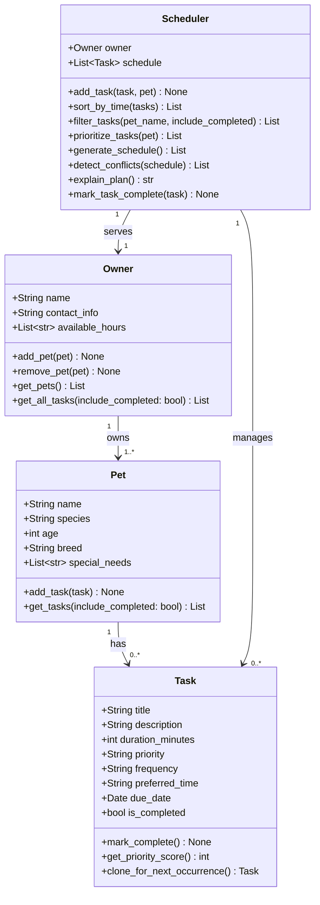

# PawPal+ Project Reflection

## 1. System Design

**a. Initial design**

The initial UML design uses four classes connected around a central `Scheduler`:

**Class responsibilities:**

I chose four classes, each with a focused, single responsibility:

- **`Task`** — Represents one atomic unit of pet care. It stores identity, duration, priority, frequency, preferred time, optional due date, and completion status. It exposes `mark_complete()` to update state and `clone_for_next_occurrence()` to create the next daily or weekly instance automatically.

- **`Pet`** — Models a single animal. It holds identity data and a private list of assigned tasks, and it exposes `add_task()` and `get_tasks()` so external code works through the pet object instead of manipulating internal lists directly.

- **`Owner`** — Represents the person responsible for the pets. It stores available hours and maintains the pet roster. `get_all_tasks()` provides a flat task list across every owned pet so the scheduler can build a single plan.

- **`Scheduler`** — Coordinates the schedule. It manages task registration, sorts tasks by time, filters tasks by pet or completion status, generates a schedule from available hours, detects same-time conflicts, and handles recurring task creation when tasks are completed.

**b. Design changes**

I made several updates after reviewing the implementation against the original plan:

1. `Scheduler.add_task()` now keeps `Pet._tasks` and the scheduler task map in sync.
2. `Scheduler.sort_by_time()` was added to present tasks in chronological order in the UI.
3. `Scheduler.filter_tasks()` was added to support pet-based and completed-status filtering.
4. `Task.clone_for_next_occurrence()` and `Scheduler.mark_task_complete()` were added so daily and weekly tasks automatically reappear on the next due date.
5. `Scheduler.detect_conflicts()` now finds duplicate scheduled times and reports lightweight warnings instead of failing silently.

---

## 2. Scheduling Logic and Tradeoffs

**a. Constraints and priorities**

My scheduler considers these constraints:

- Owner available hours: tasks must fit into the owner's free slots.
- Task priority: higher-priority tasks should be scheduled earlier.
- Preferred time: tasks with preferred times are placed at those times when possible.
- Recurrence frequency: daily and weekly tasks must reappear after completion.

I prioritized these constraints by focusing first on owner availability and urgency, then on making the schedule readable for the owner with preferred times. Recurrence was added so the system supports repeating care tasks without manual recreation.

**b. Tradeoffs**

One tradeoff is that conflict detection only checks for exact same-time overlaps, not multi-minute duration overlaps. This is reasonable for this phase because it keeps the system simple and still catches the most obvious scheduling problems. A more advanced version would need interval arithmetic and duration-based overlap checks.

---

## 3. AI Collaboration

**a. How you used AI**

I used AI as a development partner in several ways:

- To research `st.session_state` and make the Streamlit app stateful.
- To get guidance on sorting with Python `sorted(..., key=lambda ...)` for time-based task ordering.
- To shape conflict detection into a lightweight warning mechanism rather than a hard failure.
- To draft tests and verify the behavior of recurring tasks and schedule generation.

The most helpful prompts were specific implementation questions like "How can I sort tasks by HH:MM time string?" and "How can I detect duplicate task times without crashing?".

**b. Judgment and verification**

I did not accept every AI suggestion as-is. For example, AI initially recommended scheduling tasks purely by priority, but I modified that to preserve preferred times and availability. I verified the final approach by writing and running unit tests, and by checking the Streamlit UI logic against the actual `Scheduler` methods.

---

## 4. Testing and Verification

**a. What you tested**

I tested the most important scheduler behaviors:

- Task completion state changes cleanly with `mark_complete()`.
- Tasks are sorted correctly by preferred time using `Scheduler.sort_by_time()`.
- Marking a daily task complete creates a new task due the next day.
- Duplicate scheduled times generate conflict warnings through `Scheduler.detect_conflicts()`.

These tests were important because they verify the core algorithmic behavior that makes the app more than just a form-based prototype.

**b. Confidence**

I am fairly confident in the current scheduler behavior for the features implemented. The system works well for the happy path and for the exact-time conflict cases we set out to support.

If I had more time, I would add tests for overlapping durations, unscheduled overflow tasks, and repeated weekly task behavior.

---

## 5. Reflection

**a. What went well**

I am most satisfied with connecting the backend logic to the Streamlit UI and making state persist through `st.session_state`. That bridge turned the app into a usable tool instead of a static mockup.

**b. What you would improve**

If I had another iteration, I would improve the scheduler by tracking task durations explicitly in the timeline, adding a conflict model for overlapping intervals, and giving the user a way to edit or delete tasks after creation.

**c. Key takeaway**

The key takeaway is that the human role is the architecture: AI helped suggest syntax and design patterns, but I had to choose the right tradeoffs and keep the final structure coherent. Using separate chat sessions for design, implementation, and testing kept the work organized and made it easier to validate each phase.
